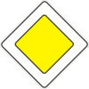
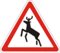

# Software für autonomes Fahren - Trainingsdaten Yolo

Dieses Repository beinhaltet die Trainingsdaten für die Verkehrszeichenerkennung.

Die Daten stammen von dem GTSRB - German Traffic Sign Recognition Benchmark Datensatz: https://www.kaggle.com/datasets/meowmeowmeowmeowmeow/gtsrb-german-traffic-sign

## 100%
Beinhaltet alle Verkehrszeichen, diese sind:

## 63%
Beinhaltet nur die Verkehrszeichen, die in der Projektbeschreibung definiert wurden. Diese sind folgende:
